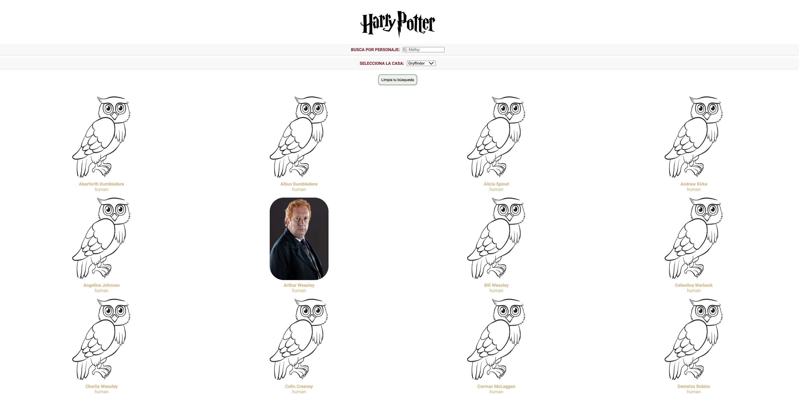

    

# LOS PERSONAJES DE HARRY POTTER

A través de la siguiente aplicación podrás adentrarte en el universo de Harry Potter y conocer a sus personajes.

## FUNCIONALIDADES

- Al cargar la página podrás ver todos los personajes disponibles (ordenados alfabéticamente) de Gryffindor, la casa seleccionada por defecto.
- A través del filtro select podrás hacer que aparezcan los personajes de todas las casas o los de cada una de ellas.
- Además, se incluye un filtro por nombre, que te mostrará los personajes que contengan tu búsqueda (texto introducido y casa seleccionada).
- Si quieres volver al estado incial solo tienes que activar el botón de limpiar búsqueda.
- Por último, si pinchas la tarjeta de cada personaje podrás ver detalles como si está vivo o muerto, sus nombres alternativos (si los tiene), etc.
- Aquí tienes una vista global de la web:

## TECNOLOGÍAS UTILIZADAS

- [React](https://reactjs.org/): biblioteca de JavaScript para construir interfaces de usuario.
- [React Router](https://reactrouter.com/): enrutador para aplicaciones de React que permite la navegación entre diferentes componentes.
- [PropTypes](https://reactjs.org/docs/typechecking-with-proptypes.html): sistema de verificación de tipos para props en componentes de React.
- [SCSS](https://sass-lang.com/): preprocesador de CSS que ofrece una sintaxis más poderosa y mantenible para estilos en la web.
- [fetch API](https://developer.mozilla.org/en-US/docs/Web/API/Fetch_API): Interfaz JavaScript para acceder y manipular partes del canal HTTP, como peticiones y respuestas.

## CONTRIBUCIONES Y FEEDBACK

¡Gracias por explorar _LOS PERSONAJES DE HARRY POTTER_! Si encuentras problemas o tienes sugerencias de mejora no dudes en:

- [Abrir un Issue](https://github.com/Adalab/modulo-3-evaluacion-final-INDRAKL) en este repositorio.
- Enviarme un mensaje a [indrakislo@gmail.com].

¡GRACIAS!
